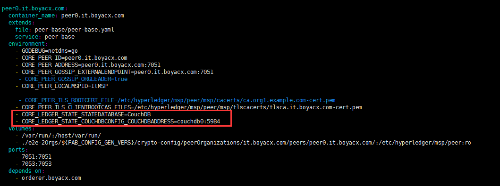

# fabric-boyacx-sdk-java
基于fabric-sdk-java release1.1.0封装搭建运用实例

* 1.down fabric-sdk-java到服务器环境并启动网络,执行src/test/fixtrue/sdkintegration/fabric.sh脚本文件，即可将网络启动。脚本命令包含了：./fabric.sh up 强制重新创建网络(默认会启动)、./fabric.sh start启动
./fabric.sh stop停止、./fabric.sh clean清理生成的docker容器

* 2.替换本项目下的src/main/resource/fabric/chaincode/example_cc.go到fabric-sdk-java项目下的src/test/fixture/sdkintegration/sample1/src/github.com/example_cc/example_cc.go,在官方chaincode基础上自定义了创建账户的操作

* 3.down fabric-sdk-java源码并执行一次测试类下的End2EndIT测试方法，执行该测试方法时为了构建一个通道，并将org加入通道，然后安装链码，实例化链码，当然也可以通过已经搭建好的环境下的cli客户端工具进行初始化创世块、安装链码、实例化链码等操作
* 3.1如果执行测试用例报错 200 400相关错误，则同步一下服务器时间（ntpdate us.pool.ntp.org）,时间相差一个小时以上就会出现此问题，还有个如果内存配置太小，在初始化智能合约代码时超过120秒钟就会连接超时，修改默认的连接超时时间即可

* 4.替换src/main/resource/fabric/crypto-config文件夹为官方提供的 cryptogen 工具运行生成的组织关系和身份证书

* 5.修改配置文件FabricManager.java，修改如下
``` java
...大约在34行，这里通道名称为自己搭建环境创建的通道上保持一致，官方fabric-sdk-java创建的通道为"foo"
private final static  String channelName = "foo" ;
...
大约在89行，指定调用的链码为搭建的环境上安装的链码保持一致
config.setChaincode(getChaincode(channelName, "example_cc_go", "github.com/example_cc", "1"));
...
大约在98行左右，getOrderers方法中，修改你的orderer节点服务器地址,搭建的环境上有几个order节点则添加几个
orderer.addOrderer("orderer0.example.com", "grpc://x.x.x.xx:7050");
...
大约在114行左右，getPeers方法中，修改你的peer节点服务器地址
peers.addPeer("peer0.org1.example.com", "peer0.org1.example.com", "grpc://x.x.x.xx:7051", "grpc://x.x.x.xx:7053", "http://x.x.x.xx
``` 
* 6.运行FabricManagerTest单元测试，包含了创建账户、账户转账、以及查询账户


## 自定义org和example.com
  * 1.修改chaincodeendorsementpolicy.yaml 、docker-compose.yaml、peer-base/peer-base.yaml相关的配置
  * 2.修改crypto-config.yaml配置并执行命令cryptogen generate --config=./crypto-config.yaml生成相应的秘钥和证书文件夹crypto-config
  * 3.替换fabric-sdk-java/src/test/fixture/sdkintegration/e2e-2Orgs/v1.1下官方生成的crypto-config目录
  * 4.修改configtx.yaml对应配置并执行命令configtxgen -profile TwoOrgsOrdererGenesis -outputBlock ./channel-artifacts/orderer.block生成排序节点创世区块orderer.block
  * 5.替换fabric-sdk-java/src/test/fixture/sdkintegration/e2e-2Orgs/v1.1下官方的排序创世区块orderer.block
  * 6.执行命令configtxgen -profile TwoOrgsChannel -outputCreateChannelTx ./channel-artifacts/foo.tx -channelID foo创建频道配置交易foo.tx，同上进行替换
  * 7.修改fabric-sdk-java源码下的org1、org2、example.com相关的所有类，在执行End2endIT测试类，安装链码实例化链码，测试通过即自定义成功
  * 7.1替换服务器中新生成的crypto-config文件夹到项目中,替换TestConfig.java类中的配置、修改End2endIT.java中203行和215行peer节点的名称
  
## peer使用CouchDb替换默认的leveldb作为状态数据库
  * 1.修改docker-compose.yaml启动文件，添加对应peer节点数量的CouchDb
  
  * 2.修改docker-compose.yaml启动文件，在对应peer节点下增加如下配置
  
  
## 搭建F.N.S区块链平台
  * 1.搭建fabric网络，搭建教程见以上
  * 2.创建频道配置交易xxx.tx,并将所有的peer节点加入通道
  * 2.1通过docker进入到cli容器中执行命令peer channel create -o orderer.boyacx.com:7050 -c collection -f ./channel-artifacts/collection.tx --tls true --cafile /opt/gopath/src/github.com/hyperledger/fabric/peer/crypto/ordererOrganizations/boyacx.com/orderers/orderer.boyacx.com/msp/tlscacerts/tlsca.boyacx.com-cert.pem
  * 2.2修改环境变量到其他peer节点上，然后加入通道
  ``` java
    root@2f3af7e64868:/opt/gopath/src/github.com/hyperledger/fabric/peer# peer channel join -b mychannel.block
root@2f3af7e64868:/opt/gopath/src/github.com/hyperledger/fabric/peer# CORE_PEER_MSPCONFIGPATH=/opt/gopath/src/github.com/hyperledger/fabric/peer/crypto/peerOrganizations/org1.example.com/users/Admin@org1.example.com/msp CORE_PEER_ADDRESS=peer1.org1.example.com:7051 CORE_PEER_LOCALMSPID="Org1MSP" CORE_PEER_TLS_ROOTCERT_FILE=/opt/gopath/src/github.com/hyperledger/fabric/peer/crypto/peerOrganizations/org1.example.com/peers/peer0.org1.example.com/tls/ca.crt peer channel join -b mychannel.block
root@2f3af7e64868:/opt/gopath/src/github.com/hyperledger/fabric/peer# CORE_PEER_MSPCONFIGPATH=/opt/gopath/src/github.com/hyperledger/fabric/peer/crypto/peerOrganizations/org2.example.com/users/Admin@org2.example.com/msp CORE_PEER_ADDRESS=peer0.org2.example.com:7051 CORE_PEER_LOCALMSPID="Org2MSP" CORE_PEER_TLS_ROOTCERT_FILE=/opt/gopath/src/github.com/hyperledger/fabric/peer/crypto/peerOrganizations/org2.example.com/peers/peer0.org2.example.com/tls/ca.crt peer channel join -b mychannel.block
root@2f3af7e64868:/opt/gopath/src/github.com/hyperledger/fabric/peer# CORE_PEER_MSPCONFIGPATH=/opt/gopath/src/github.com/hyperledger/fabric/peer/crypto/peerOrganizations/org2.example.com/users/Admin@org2.example.com/msp CORE_PEER_ADDRESS=peer1.org2.example.com:7051 CORE_PEER_LOCALMSPID="Org2MSP" CORE_PEER_TLS_ROOTCERT_FILE=/opt/gopath/src/github.com/hyperledger/fabric/peer/crypto/peerOrganizations/org2.example.com/peers/peer0.org2.example.com/tls/ca.crt peer channel join -b mychannel.block
  ``` 
  * 3.到F.N.S平台创建对应的组件并验证测试
  

## 待优化的问题
 * 自定义搭建org
 * 自定义chaincode
 * 使用单独的CA节点来生成证书
### 踩坑事迹
 * 1.go环境变量必须配置GOROOT，否则执行生成证书文件会失败
 * 2.Channel foo 测试用例完全成功,Channel bar 测试用例运行失败,stackoverflow说这里是版本不一致导致
 * 3.如果Channel bar 用例跑失败，检查4个peer节点是否成功启动以及2个ca节点和一个orderer节点
 * 4.Fabric不支持对同一个数据的并发事务处理，也就是说，如果我们同时运行了a->b 10元，b->a 10元，那么只会第一条Transaction成功，而第二条失败。因为在Committer节点进行读写集版本验证的时候，第二条Transaction会验证失败。这是我完全无法接受的一点！
 * 5.Fabric是异步的系统，在Endorser的时候a->b 10元，b->a 10元都会返回给SDK成功，而第二条Transaction在Committer验证失败后不进行State Database的写入，但是并不会通知Client SDK，所以必须使用EventHub通知Client或者Client重新查询才能知道是否写入成功。
 * 6.不管在提交节点对事务的读写数据版本验证是否通过，因为Block已经在Orderer节点生成了，所以Block是被整块写入区块链的，而在State Database不会写入，所以会在Transaction之外的地方标识该Transaction是无效的。
 * 7.query没有独立的函数出来，并不是根据只有读集没有写集而判断是query还是Transaction。